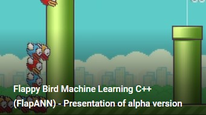
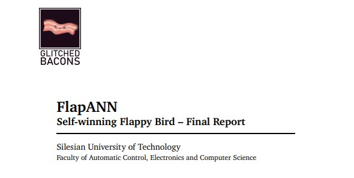

# FlappANN
A game that passes itself. With the help of machine learning, this time it's the AI that learns how to pass the flappy bird from scratch. This project was created for the course *Biologically inspired artificial intelligence* in the 6th semester of the full-time course in Computer Science. 

A gif showing how the application works

### Short video
We encourage you to watch this video showing the app in action!

<a href="https://www.youtube.com/watch?v=yj8cZ4-YjRM">
    
    
A video showing how the application works

    

</a>

### Goal of the project

Also take a peek at our extensive report on this project:

Application Specification (<a href="docs/Report.pdf">click to view</a>).

### Used Frameworks
* SFML
* ImGui
* ImGui-SFML
* FANN

## Authors
* [Dawid Grobert](https://github.com/Notiooo)
* [Julia Boczkowska](https://github.com/JuliaBoczkowska)